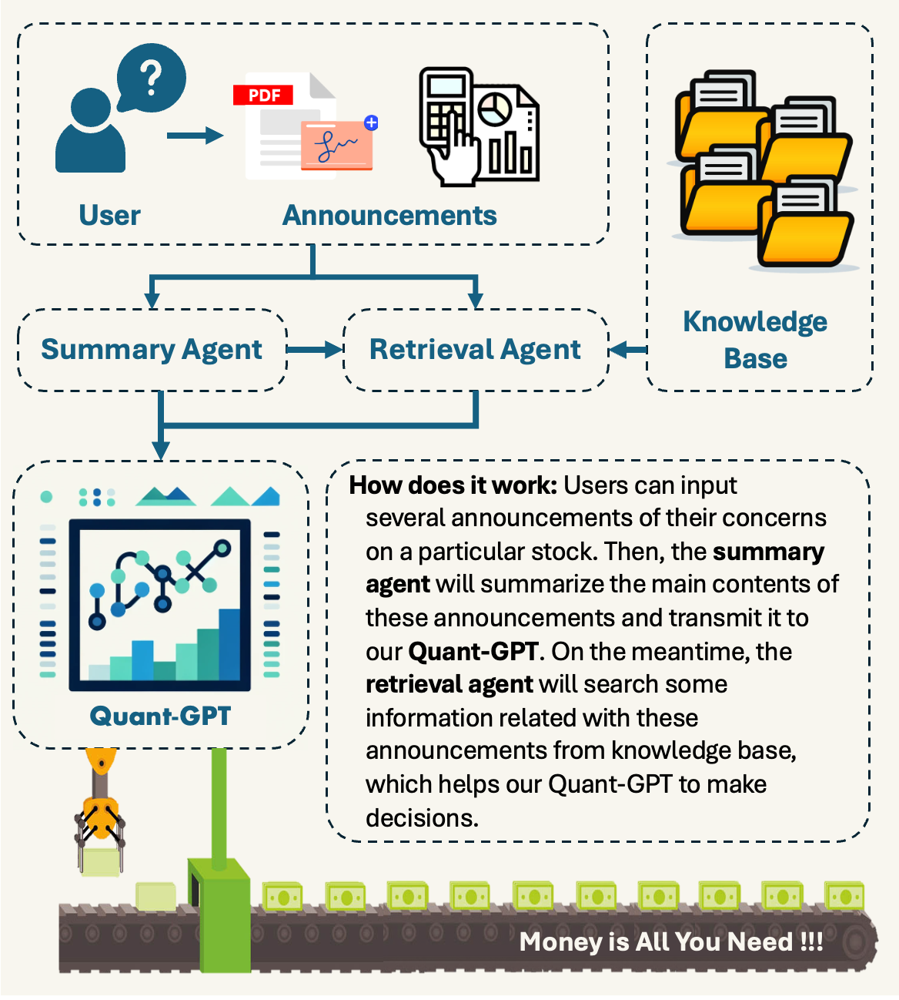
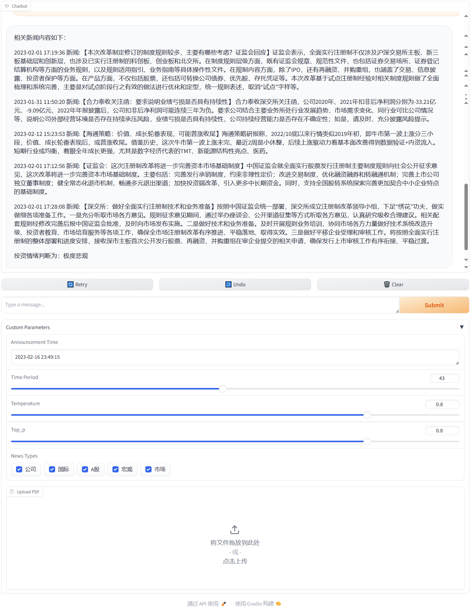

# Quant-GPT

## Team members

Yuzhe Yang, Kangqi Yu, Junquan Peng

## Introduction

The core recipe of Quant-GPT is to leverage both both distilled sentiment analysis data from ChatGPT and real-world announcements from the A shares market in the supervised fine-tuning stage. This is not only because purely using ChatGPT-distilled data might cause "model collapse" and the weak causality between sentiment and expected return, but also because real-world data from the A shares market reflects the common expectation of all the investors.

To synergize the strengths of finance news, we introduce RAG (Retrieval-Augmented Generation) where a searching tool is designed to retrieve related news of company announcements, assisting Quant-GPT make more accurate judgments on the expected return of the announcement.

## Motivation

The core recipe of Quant-GPT is to leverage both both distilled sentiment analysis data from ChatGPT and real-world announcements from the A shares market in the supervised fine-tuning stage. This is not only because purely using ChatGPT-distilled data might cause "model collapse" and the weak causality between sentiment and expected return, but also because real-world data from the A shares market reflects the common expectation of all the investors.
To synergize the strengths of finance news, we introduce RAG (Retrieval-Augmented Generation) where a searching tool is designed to retrieve related news of company announcements, assisting Quant-GPT make more accurate judgments on the expected return of the announcement.

## Demo

